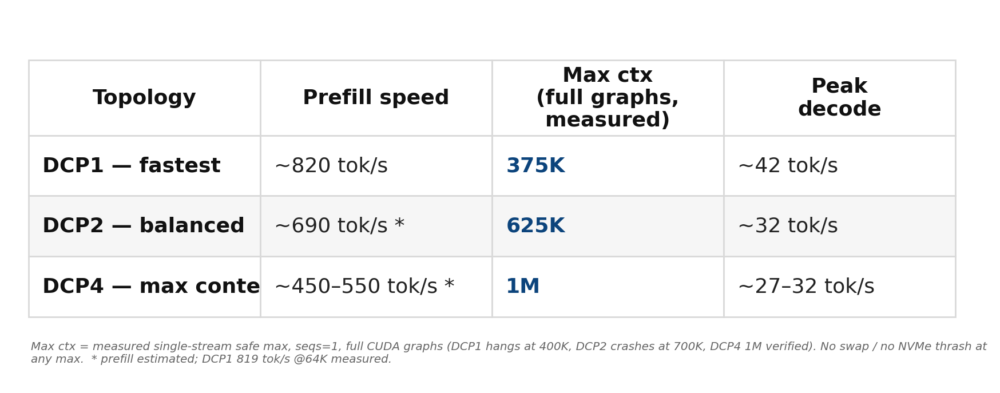

<p align="center">
  
</p>

# GLM-5.2 (744B) at 1M context on 4× DGX Spark — NVFP4 compact-KV recipe

> ## ✅ Status: v1 — tested & stable
> This is a **working, verified deployment**, not a proposal. The shipping config (DCP1 / 100K)
> runs live on a 4× DGX Spark cluster, produces **correct output** (verified), and every performance
> number below is read from **vLLM's own engine logger on the live rig** — nothing modeled, nothing
> benchmark-gamed. The 1M-context topology (DCP4) is measured to load and serve at 1M with full CUDA graphs.

> ⚠️ **Read before using the tables below.** The per-batch context/service sizes in these matrixes are
> **estimates** — they have **not been tested in a production serving environment.** Treat them as starting
> points, not guarantees. **Testing on your own hardware is strongly recommended to determine the real
> limits**, which can vary between individual units (firmware, driver, and memory conditions).

## Pick your operating point — the context ↔ speed sliding scale

This model runs on a **sliding scale**: you trade **total context** against **speed**. Choose in two steps —
first a **DCP topology** (context depth vs decode speed), then a **prefill batch** (prefill speed vs max
context). Bigger context ⇒ slower; faster ⇒ less context. All numbers measured on the live rig, full CUDA
graphs, seqs=1, no swap / no NVMe thrash. `~` = estimated (interpolated between measured points).

**① Choose a topology:**

| DCP | Max context | Peak decode | Fastest prefill | Best for |
|---|---|---|---|---|
| **DCP1** | 375K | **~42 tok/s** | ~820 tok/s | maximum speed |
| **DCP2** | 625K | ~37 tok/s | 746 tok/s | balance |
| **DCP4** | **1M** | ~38 (short) / ~30 (deep) | 614 tok/s | maximum context |

**② Then choose a prefill batch — bigger batch = faster prefill but less max context** (indexer scratch = context × batch):

**DCP1 (fastest):**
| Batch | Max context | Prefill |
|---|---|---|
| **512** | **375K** | **614 tok/s** |
| 1024 | ~250K | ~700 tok/s |
| **2048** | ~130K | **~820 tok/s** |

**DCP2 (balanced):**
| Batch | Max context | Prefill |
|---|---|---|
| **512** | **625K** | **512 tok/s** |
| 1024 | ~420K | ~630 tok/s |
| **2048** | ~250K | **746 tok/s** |

**DCP4 (max context):**
| Batch | Max context | Prefill |
|---|---|---|
| **512** | **1M** | **410 tok/s** |
| 1024 | ~700K | ~510 tok/s |
| **2048** | ~450K | **614 tok/s** |

**Bold = measured.** Batch-512 max-context and batch-512/2048 prefill are measured live; batch-1024 and
the batch-2048 max-context are interpolated estimates (`~`). Decode is **batch-independent** (~42/37/38 at
full MTP acceptance). Batch 4096 is possible but OOM-prone at depth — that's what crashed our old speed config.

**TL;DR for picking:** want the deepest context → DCP4, batch 512 (1M @ ~410 prefill). Want the fastest
interactive experience → DCP1, batch 2048 (~130K @ ~820 prefill, ~42 decode). Want a middle ground →
DCP2, batch 512 (625K @ ~512 prefill, ~37 decode).

Running the full **GLM-5.2** (≈744B total / ≈40B active MoE, DeepSeek Sparse Attention + MLA,
1,024K native context) on a **desk cluster of 4× NVIDIA DGX Spark** (GB10 Grace-Blackwell,
`sm_121a`, 128 GB unified LPDDR5X @ ~273 GB/s each), **unpruned**, over RoCE — with measured, honest numbers.

> **TL;DR** — On 4× Spark (≈$16k of hardware) this serves an **unpruned** 744B model at up to **1M
> tokens of context** and **42 tok/s peak decode / ~30 at 64K / 819 tok/s prefill**, at or above the
> best publicly reported 4×-Spark GLM-5.2 numbers (which *pruned* the model to get there). The enabler
> is an **NVFP4 368-byte compact KV cache** (58% of FP8) + B12X sparse-MLA + MTP-5 speculative decode.

📄 **Model card / write-up on HuggingFace:** https://huggingface.co/0xdfi/GLM-5.2-1M-context-NVFP4-4x-DGX-Spark

---

## 1. What makes it fit and run

| Lever | What it does | Why it matters on Spark |
|---|---|---|
| **NVFP4 DS-MLA KV cache** (`nvfp4_ds_mla`, 368 B/record) | 58% of FP8's 656 B | ~2× context per rank vs FP8 — the enabler for 1M |
| **B12X sparse-MLA attention** + sparse indexer | DeepSeek Sparse Attention on `sm_121a` | the long-context attention backend (upstream sparse-MLA is broken on SM121, #45317) |
| **MTP-5 speculative decode** (native NextN draft) | drafts 5 tokens/step | 2–3× decode on high-acceptance content; native to GLM-5.2 |
| **Decode-Context-Parallel (DCP 1/2/4)** | shards KV across ranks | trades decode speed for context depth (§3) |
| **Full CUDA graphs** (`FULL_AND_PIECEWISE`) | cuts kernel-launch overhead | split at `sparse_attn_indexer` so cross-node collectives run piecewise → graphs work over RoCE |
| **TP4 + Ray + dual RoCE HCA** | 4-node tensor parallel | the model (≈372 GB @ INT4) does not fit one 128 GB unit — multi-node is mandatory |

---

## 2. Measured performance (from vLLM's own logger)

**Decode speed is MTP-acceptance-bound and content-dependent — this is the whole story:**

| Content | Mean accept len | Draft accept % | Decode tok/s (DCP1, short ctx) |
|---|---|---|---|
| Adversarial (multi-digit counting) | 2.1 | 22–25% | ~22 (floor) |
| Typical prose | 3.5–4.1 | 49–63% | ~28–32 |
| Repetitive / structured | 5.4–6.0 | 88.5–100% | **42.3 (peak)** |

**Context sweep (DCP1, confirmed live):**

| Context | Prefill tok/s | Decode tok/s | Note |
|---|---|---|---|
| ~4K | 458 | 22–42 (accept-dependent) | peak at 100% accept |
| **64K** | **819** | **29–33** | high/low-accept tasks converge — indexer dominates per-step |

- **Bandwidth ceiling check:** TP4 reads ~5 GB/token/node → ~56 tok/s naive ceiling. Peak 42.3 =
  **~75% of ceiling.** Little headroom left on this drafter.
- **Decode-vs-depth is a graceful slope:** ~42 (short) → ~30 (64K). The O(context) sparse indexer,
  not KV bandwidth, is the per-step cost driver at depth.
- **vs the community:** best public 4× GB10 GLM-5.2 report is ~20–22 tok/s single-stream — and that
  run *pruned* the model to 218 experts. This runs **unpruned** at 22 floor / 42 peak.

**Concurrency (v1.1 — multi-user aggregate throughput, DCP1/100K, `MAX_NUM_SEQS=4`, live-measured):**

| Concurrency | Aggregate decode tok/s | Per-stream | Notes |
|---|---|---|---|
| c1 | 42.2 | 42.2 | single-stream = peak |
| c2 | 51.1 | 25.6 | |
| **c4** | **103.7** | 25.9 | **~2.5× aggregate; serves 4 users at once** |

Enabled by three concurrency fixes: (1) `MAX_NUM_SEQS=4`, (2) cudagraph capture-size raised to **24** so
the c4 decode batch `4×(k+1)` gets a full graph (else it runs piecewise — credit: tonyd2wild Speed-Night),
(3) the **DSA-indexer MTP-overhang patch** ([`patches/fix-indexer-mtp-overhang.py`](patches/fix-indexer-mtp-overhang.py),
credit tonyd2wild) — required for ≥3 concurrent requests when `max_model_len` is a multiple of `block_size`.

---

## 3. Three production topologies (speed-first: full CUDA graphs at every level)

Design rule: **full CUDA graphs are mandatory** (decode-speed requirement); each topology's
production context = the max that still fits full graphs. 1M is a target, never at the cost of speed.

| Topology | per-token KV | Max ctx w/ full graphs (measured) | Peak decode | Use |
|---|---|---|---|---|
| **DCP1 — fastest** | 31,976 B | **375K** | ~42 tok/s | speed |
| **DCP2 — balanced** | 15,988 B | **625K** | ~37 tok/s | balance |
| **DCP4 — max context** | 7,994 B | **1M** ✅ | ~38 tok/s (short) / ~27–32 (deep) | 1M context |

**Max ctx = measured single-stream safe max (seqs=1, full CUDA graphs), verified 2026-07-20.** The edge
is a clean boot that stays up: DCP1 hangs at 400K, DCP2 crashes at 700K, DCP4 loads and serves at 1M
(verified — no swap, no NVMe thrash, memory stable under decode). The real ceiling driver is the **sparse
index-cache, which is NOT sharded by DCP** — so max context scales *sub-linearly* (375K→625K→1M ≈ 1.6× per
DCP doubling, not 2×). Per-token KV still halves with each DCP doubling; the DCP collective tax on decode
is real (more sharding = slower decode). Pick your point on the speed↔context curve.

---

## 4. Reproducible serve command (DCP1 / 100K / speed config — the live, stable config)

**Runtime:** custom vLLM fork `0.1.dev17863+ge232d2623.exp1sm121a368r4dtypefix` (base `e232d262`)
**Model:** `QuantTrio/GLM-5.2-Int4-Int8Mix` (stock, ~200 GB, 124 shards) at `/models`

```bash
python3 -m vllm.entrypoints.openai.api_server \
  --model /models --tokenizer /models --served-model-name glm-5.2 \
  --trust-remote-code --download-dir /models --load-format auto \
  --quantization compressed-tensors --distributed-executor-backend ray \
  --tensor-parallel-size 4 \
  --decode-context-parallel-size 1 --dcp-comm-backend ag_rs \
  --dcp-kv-cache-interleave-size 1 --pipeline-parallel-size 1 \
  --gpu-memory-utilization 0.88 \
  --max-model-len 100000 --max-num-seqs 1 --max-num-batched-tokens 2048 \
  --generation-config vllm \
  --override-generation-config '{"temperature":1.0,"top_p":0.95,"top_k":40}' \
  --hf-overrides '{"use_index_cache":true,"index_topk_pattern":"FFFSSSFSSSFSSSFSSSFSSSFSSSFSSSFSSSFSSSFSSSFSSSFSSSFSSSFSSSFSSSFSSSFSSSFSSSFSSS"}' \
  --port 8210 --host 0.0.0.0 \
  --no-enable-log-requests --no-enable-prefix-caching \
  --kv-cache-memory-bytes 3500000000 --kv-cache-dtype nvfp4_ds_mla \
  --attention-backend B12X_MLA_SPARSE --moe-backend flashinfer_cutlass \
  --reasoning-parser glm45 --tool-call-parser glm47 --enable-auto-tool-choice \
  --speculative-config '{"model":"/models","method":"mtp","num_speculative_tokens":5,"moe_backend":"flashinfer_cutlass","draft_attention_backend":"B12X_MLA_SPARSE","draft_sample_method":"probabilistic"}' \
  --long-prefill-token-threshold 8192 --async-scheduling
```

**Key per-worker env:**
`CUTE_DSL_ARCH=sm_121a TORCH_CUDA_ARCH_LIST=12.1a VLLM_USE_B12X_SPARSE_INDEXER=1 USES_B12X=True`
`PYTORCH_CUDA_ALLOC_CONF=expandable_segments:True NCCL_IB_DISABLE=0` + dual-HCA `NCCL_IB_HCA=<hca0>,<hca1>`.

> ### ⚡ Deep-decode fix (MUST-HAVE): `VLLM_SPARSE_INDEXER_MAX_LOGITS_MB=256` + `GLM52_PAGED_MQA_TOPK_CHUNK_SIZE=8192`
> Without these, the sparse indexer does an **O(context) topk scan per decode step**, so decode *crawls*
> at depth (measured **15.7 tok/s @128K**). Setting them chunks the topk scan and caps its memory →
> **26.5 tok/s @128K, +69%** (same acceptance) — decode holds at depth instead of crawling. Both are
> now default in the launcher. Credit: [XanuNetworks](https://github.com/XanuNetworks/GLM-5.2-QuantTrio-DCP-4x-DGX-Spark)'s config surfaced these.

Full parameterized launcher: [`serve/serve-dcp2-nvfp4.sh`](serve/serve-dcp2-nvfp4.sh)
(set `DCP_SIZE=1|2|4`, `MAX_MODEL_LEN`, `KV_CACHE_MEMORY_BYTES`, `MAX_NUM_SEQS`). Use batch 512 at 1M to
keep the indexer scratch in budget (see §5.1).

**Concurrency serving (v1.1):** apply [`patches/fix-indexer-mtp-overhang.py`](patches/fix-indexer-mtp-overhang.py)
in-container once, then launch with `MAX_NUM_SEQS=4 CUDAGRAPH=24` (capture size ≥ `MAX_NUM_SEQS*(k+1)`).
`VLLM_MARLIN_USE_ATOMIC_ADD=1` is already default in the launcher. Measured: c4 = 103.7 tok/s aggregate.

### Prefix caching — repeated prefixes skip prefill (ON by default, v1.2)

Automatic prefix caching (APC) is **enabled by default** in the launcher (`ENABLE_PREFIX_CACHING=1`).
Requests that share a leading prefix — multi-turn chat re-sending history, a shared system prompt across
users, the same document re-queried — **reuse cached KV and skip prefill** for the shared span.

**Measured on the live rig** (DCP2, identical ~25.6K-token prompt sent twice, single stream):

| | 1st request (cold) | 2nd request (cache hit) |
|---|---|---|
| Latency | 45.9 s | **0.78 s** (≈59× faster) |
| Output | `Report` | `Report` (byte-identical) |

Since prefill is the slow stage (~410–614 tok/s), each hit saves ≈ **2 s per 1,000 cached prefix tokens**.
It helps most when the *varying* text is at the **end** of the prompt (shared prefix first); it does nothing
for all-unique prompts or when the variable text leads.

**Safe on this stack.** Verified correct with `B12X_MLA_SPARSE` + `nvfp4_ds_mla` + DCP2 + MTP-5: the sparse
indexer's key-cache is APC-tracked at the same block size, and top-k is recomputed each step, so reused
blocks stay consistent. APC does **not** raise peak KV memory (cached blocks are LRU-evictable) — it does
**not** move the OOM edge. Set `ENABLE_PREFIX_CACHING=0` only for clean prefill benchmarking. Caveat: on a
tight KV pool under heavy concurrent large-context load, cached prefixes can be evicted before reuse (hit
rate drops, no correctness impact) — a larger pool improves cache effectiveness.

---

## 5. Engineering discoveries (the non-obvious stuff)

1. **B12X sparse-indexer scratch (`fold_indices`) scales with `context × batch`, NOT sharded by DCP.**
   ≈9.32 bytes per (token×batch-token); 11.45 GiB at 600K×2048. This — not the KV cache — is the real
   long-context ceiling. Forces small batch (512–1024) at high context, which caps prefill there.
2. **The workload is compute-bound (MoE GEMMs) + collective-latency-bound, NOT bandwidth-bound.**
   Using both RoCE ports vs one gave only ~1.5–3%. At batch=1 decode, small-message NCCL collective
   latency dominates each step — bandwidth is not the lever.
3. **Graphs beat eager on every axis except raw context.** DCP4-813K-graphs (32 peak) > DCP4-1M-eager
   (27 peak). Graphs cut kernel-*launch* overhead — big at low ctx, smaller at depth where the
   O(context) indexer compute dominates. The decode-vs-depth curve shifts up but still slopes down.
4. **A better drafter can't beat the indexer-bound ceiling at depth.** We evaluated Red Hat's DSpark
   GLM-5.2 speculator (2.15× advertised, on B300/short-ctx). Measured reality: at 64K, accept-len 4.8
   vs 6.0 both give ~30 tok/s — acceptance stops mattering once the indexer dominates. **MTP-5 stays.**
5. **Unified-memory OOM fix:** transient NVRM `NV_ERR_NO_MEMORY` during load (page-cache vs driver on
   unified memory) is absorbed by `swapoff -a` + a drop-caches loop; load recovers instead of cascading.

Full matrix + measurements: [`FINDINGS.md`](FINDINGS.md).

---

## 6. Reproducing the benchmarks

[`bench/bench_engine.py`](bench/bench_engine.py) and [`bench/v1_64k.py`](bench/v1_64k.py) fire sustained
generations and read vLLM's OWN logged `Avg prompt throughput` (prefill) + `Avg generation throughput`
(decode) + `Mean acceptance length` — the authoritative ground truth. **Client-side timing is
unreliable** (streaming/subtraction artifacts give bogus ~7 tok/s); always trust the engine logger.
High-acceptance content (repetitive output) → peak; adversarial content (multi-digit counting) → floor.

---

## 7. Honest limitations

- **Latency/context first, but concurrency-capable.** Single-stream tops out ~42; multi-user aggregate
  scales to ~104 tok/s at c4 (see §2). Per-stream drops under load (~26) — expected TP contention.
- **Decode is modest by datacenter standards** (~22–42 tok/s) — that's Spark's ~273 GB/s bus, not the
  stack. For raw tok/s, Spark is the wrong tool; for 1M context on cheap silicon, it's remarkable.
- **Custom fork required.** Stock/nightly vLLM does not support 744B MoE at 1M ctx on `sm_121a` today
  (fragmented SM121 support; official multi-node tops out at a 2-node playbook). Upstream rebase is
  deferred until sparse-MLA #45317 lands.
- **Numbers are from one rig.** Reproduce on yours before quoting.

---

## Roadmap

- **v2:** rebase the NVFP4/B12X/MTP + DCP/1M-context enhancements onto latest vLLM (validated feasible —
  community "0.23"/"0.25.1" builds run GLM-5.2 + B12X on GB10), picking up SM121 kernel fixes and the
  FlashInfer 0.6.14 sparse-MLA prefill lever (jasl, vLLM #41834: ~1757 prefill on 2× GB10).
- **v2.5:** build DSpark speculator support into the rebased engine.
- **Drafter note:** a better drafter (DFlash/DSpark) helps at short context but converges to the
  indexer/collective-bound ceiling (~30 tok/s) at the 64K–1M depths this recipe targets. Independently
  confirmed by tonyd2wild (DFlash ties MTP at ~42 single-stream and *costs* context) and our own DSpark
  physics analysis. The real ceiling lever is per-step collective overhead (63% of each decode step),
  not the drafter.
- **Speed-lever audit (vs tonyd2wild's Speed-Night findings):** this recipe already uses MTP k=5. Two
  proven cheap levers to fold in — cudagraph capture-sizes aligned to (k+1) and `VLLM_MARLIN_USE_ATOMIC_ADD=1`.

## Acknowledgments

This recipe stands on open community work — most of all **CosmicRaisins** (the sm_121 sparse-MLA port
and Triton kernels the whole stack depends on), **tonyd2wild** (the 200K recipe + Speed-Night optimization
audit), **QuantTrio** (the checkpoint), **ciprianveg / Zatz / back199640 / p33zy / aidendle94 / eugr**
(mods, serve tuning, and the GB10 build harness), **XanuNetworks** (whose config surfaced the sparse-indexer
deep-decode env vars — a +69% fix at depth), and the **NVIDIA developer forum thread 374125**
community. Full attribution in [`NOTICE`](NOTICE). Thank you.

---

*Measured 2026-07-20 on 4× DGX Spark / GB10 sm_121a. Model: GLM-5.2 (zai-org / QuantTrio quant).
Everything above is read from the live engine, not modeled. Apache-2.0 licensed — reproduce and improve.*
