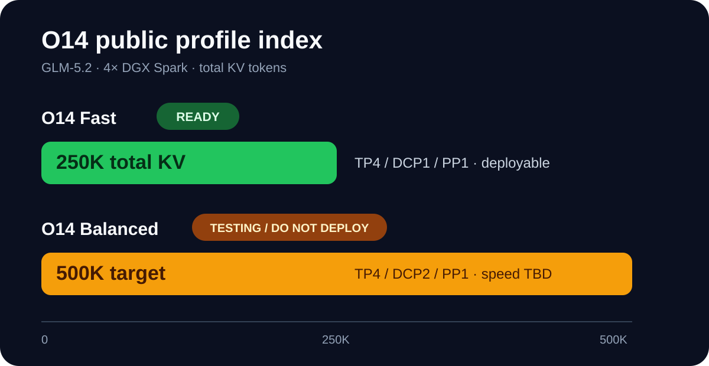

<p align="center">
  
</p>

# GLM-5.2 O14 profiles on 4× DGX Spark

This repository is the public profile index for the O14 GLM-5.2 runtime. Machine-readable selection is in [`profiles/o14-profiles.json`](profiles/o14-profiles.json); automation rules are in [`AGENTS.md`](AGENTS.md).

## Current profiles

| Profile | Status | Topology | Total KV | Deploy? | Runtime artifact |
|---|---|---:|---:|---:|---|
| **O14 Fast** | **READY** | TP4 / DCP1 / PP1 | **250K** | **Yes** | Build from the [canonical O14 Harness source](https://github.com/0xdfi/GLM-5.2-Harness-O14-4x-DGX-Spark/tree/main) |
| **O14 Balanced** | **TESTING / DO NOT DEPLOY** | TP4 / DCP2 / PP1 | **500K target** | **No** | None; separate immutable runtime required after acceptance |

### Matched-speed results

Balanced speed remains `TBD` until the exact retained DCP1 fixture set is run against the accepted DCP2 runtime. No DCP2 speed value is inferred.

| Profile | Prefill | Peak decode | Deep-context decode | Fixture status |
|---|---:|---:|---:|---|
| **O14 Fast** | **819 tok/s** | **42.3 tok/s** | **29–33 tok/s** at ~53K prompt tokens | Retained legacy exp1 DCP1 fixtures |
| **O14 Balanced** | **TBD** | **TBD** | **TBD** | Run the exact DCP1 fixtures after DCP2 acceptance |

## O14 Fast

**O14 Fast is READY and deployable at 250K total KV.**

| Machine field | Exact value |
|---|---:|
| Allocator total KV | 250,023 tokens |
| `KV_CACHE_MEMORY_BYTES` | 7,995,534,848 bytes per rank |
| `MAX_MODEL_LEN` | 249,000 |
| `MAX_NUM_SEQS` | 4 |
| `MAX_NUM_BATCHED_TOKENS` | 2,048 |
| Topology | TP4 / DCP1 / PP1 |

The selector points to the canonical Harness `main` URL until its immutable named-profile commit is published. Consumers must resolve and record the exact source commit before building.

There is no published O14 Fast OCI image in phase 1. Do not invent or pull a Fast tag. Build from the pinned canonical source recipe and keep model weights outside the runtime image.

## O14 Balanced

**O14 Balanced is TESTING / DO NOT DEPLOY.** Its target is 500K total KV with an expected allocator total of 500,237 tokens, 8,000,000,000 KV bytes per rank, `MAX_MODEL_LEN=490000`, and TP4/DCP2/PP1.

Balanced speed is `TBD`. Its source recipe, image reference, and digest are intentionally `null`. Acceptance requires a separate immutable DCP2 runtime image and reproducible recipe. Agents must never synthesize a Balanced tag, reuse Fast's image, or overwrite Fast.

## Safe selection

1. Read the requested profile from [`profiles/o14-profiles.json`](profiles/o14-profiles.json).
2. Continue only when `status == "READY"` and `deployable == true`.
3. If an image reference or digest is `null`, do not pull or invent one.
4. Pin the exact source commit, verify checksums, and run the canonical validators before building.
5. Supply model paths, endpoints, ports, and network interfaces explicitly for the target environment.

See [`AGENTS.md`](AGENTS.md) for exact pull/build behavior.

## Runtime components

The current source stack combines:

- NVFP4 DS-MLA KV cache (`nvfp4_ds_mla`, 368-byte record)
- B12X sparse-MLA attention and sparse indexer for GB10 / `sm_121a`
- MTP-5 speculative decode
- TP4 plus decode-context parallelism
- full and piecewise CUDA graph execution

Model card: <https://huggingface.co/0xdfi/GLM-5.2-1M-context-NVFP4-4x-DGX-Spark>

## Legacy exp1

> **Historical evidence only — not selectable profiles.** The July 2026 exp1 work used DCP1/DCP2/DCP4 labels before the O14 profile names were adopted. Those settings and limits are not current selector values. DCP4 remains **Legacy exp1 DCP4**; it is not “O14 High.”

### Legacy exp1 topology observations

| Legacy topology | Historical max context with full graphs | Historical peak decode | Historical fastest prefill |
|---|---:|---:|---:|
| Legacy exp1 DCP1 | 375K | ~42 tok/s | ~820 tok/s |
| Legacy exp1 DCP2 | 625K | ~37 tok/s | 746 tok/s |
| Legacy exp1 DCP4 | 1M | ~38 tok/s short / ~30 tok/s deep | 614 tok/s |

These are preserved as historical observations from one rig, not deployment promises or selectable capacities. The retained DCP1 fixture values used in the current matched-speed table are 819 tok/s prefill, 42.3 tok/s peak decode, and 29–33 tok/s at ~53K actual prompt tokens.

### Legacy exp1 engineering findings

- Sparse-indexer scratch scaled with `context × batch` and was not sharded by DCP.
- One versus two active RoCE links changed measured throughput by only about 1.5–3%; this repository imposes no fixed link-count or link-rate requirement.
- CUDA graphs improved decode but consumed memory otherwise available to context.
- Decode varied with MTP acceptance at short context and converged toward the sparse-indexer ceiling at depth.
- Unified-memory load pressure required operational care around page cache and swap.

The archived matrix is in [`FINDINGS.md`](FINDINGS.md). The parameterized historical launcher and benchmark scripts remain for evidence reproduction only; they are not current profile recipes.

## Validation

```bash
python3 scripts/render_profile_chart.py --check
python3 scripts/validate_profiles.py
python3 -m unittest discover -s tests -v
```

The validator checks exact selector values/statuses, null artifact claims, chart determinism, private defaults, and stale current-profile capacities.

## License and attribution

Apache-2.0. Community attribution is preserved in [`NOTICE`](NOTICE).
